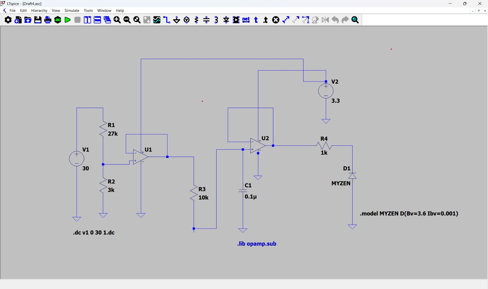
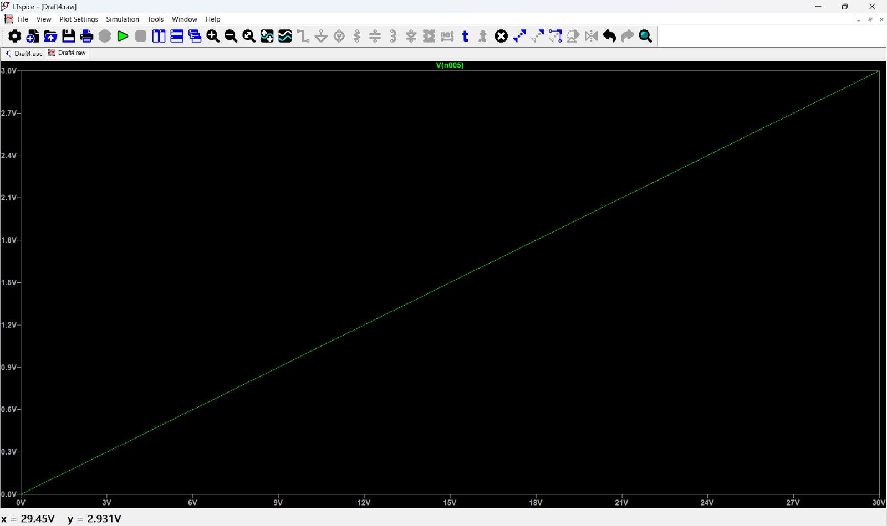

# Hardware Architecture & Circuitry

This document details the physical implementation and the analog signal conditioning layer of the Adaptive BMS framework.

## 1. Physical Prototype
The prototype is built on an ESP32 platform, utilizing high-precision current and temperature nodes for dual-branch monitoring.

*Figure 1: Physical BMS prototype featuring high-side sensing and logic-level power control.*

## 2. Analog Front-End (AFE) Design & Simulation
To safely measure the 3S battery pack voltage (12.6V max) using the ESP32's 3.3V ADC, a signal conditioning circuit was designed and validated in LTSpice.

### LTSpice Schematic
The circuit uses an op-amp buffer to ensure high input impedance and a Zener diode for overvoltage protection.

### Simulation Results (Linearity Analysis)
The simulation confirms a perfectly linear response across the 0V to 30V input range. At a maximum test voltage of **29.45V**, the output is a safe **2.931V**, well within the ESP32 ADC limits.

## 3. Circuit Topology Details:
- **Voltage Divider:** A 10:1 ratio ($R_1=27k\Omega, R_2=3k\Omega$) scales the battery voltage down.
- **Active Buffering:** Dual Op-Amp buffers provide isolation and prevent signal loading.
- **Low-Pass Filter:** An $RC$ network ($R_3=10k\Omega, C_1=0.1\mu F$) filters out high-frequency noise from PWM switching.
- **Zener Protection:** A 3.6V Zener diode acts as a hard clamp to protect the MCU from voltage spikes.

## 4. ESP32 Pin Mapping

| Component | Pin | Protocol | Purpose |
| :--- | :--- | :--- | :--- |
| **Voltage Sense** | GPIO 34 | Analog | Pack voltage monitoring (via AFE) |
| **Temp Probes** | GPIO 5 | 1-Wire | Dual DS18B20 digital thermal bus |
| **INA219 (A)** | GPIO 21/22 | I2C (0x40) | Branch A current sensing |
| **INA219 (B)** | GPIO 21/22 | I2C (0x41) | Branch B current sensing |
| **MOSFET A** | GPIO 19 | PWM | Adaptive Throttling (Branch A) |
| **MOSFET B** | GPIO 23 | PWM | Adaptive Throttling (Branch B) |

---
*Simulations performed using LTSpice XVII.*
